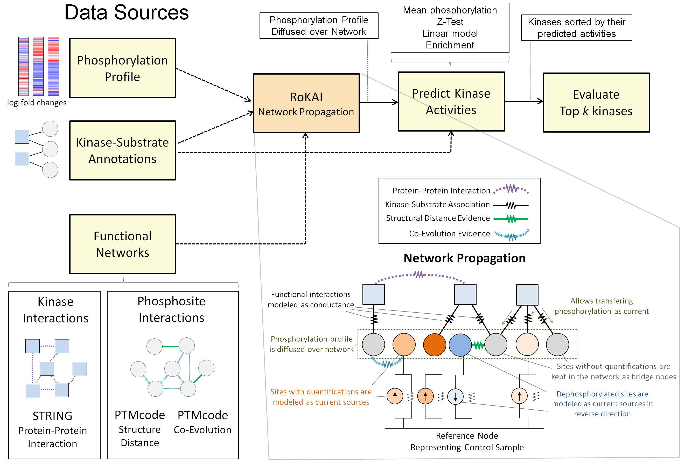

## Introduction
RoKAI is a computation tool for inferring kinase activities in a robust manner using functional networks. It is implemented in MATLAB and the source code is available in the [src folder](src/). If you are interested in performing RoKAI through a user-friendly online interface, please visit [RoKAI Web Application](https://rokai.ngrok.io/webapps/home/session.html?app=rokai).

RoKAI operates on a heterogeneous network having kinases and phosphosites as nodes and available functional associations as edges, including protein-protein interactions, kinase-substrate annotations, co-evolution and structure distance evidence between phosphosites. The key idea of RoKAI is to propagate the phosphosite quantifications on this heterogeneous network to capture the coordinated changes in the signaling, which are used to infer the kinase activities in a more robust manner.

*The workflow and the key idea of RoKAI.Traditional algorithms for kinase activity inference use condition-specific phosphorylation data and available kinase-substrate associations to identify kinases with differential activity in each condition. RoKAI integrates functional networks of kinases and phosphorylation sites to generaterobust phosphorylation profiles. The network propagation algorithm implemented by RoKAI ensures that unidentified sites that lack quantification levels in a condition canstill be used as bridges to propagate phosphorylation data through functional paths.*

## Getting Started
This section is under construction. In the meanwhile, you can check out the [user manual](rokai_user_manual.pdf). 
For the data used in [the demo](demo_rokai.m), check out the [data preprocessing section](src/data_preprocessing/).
