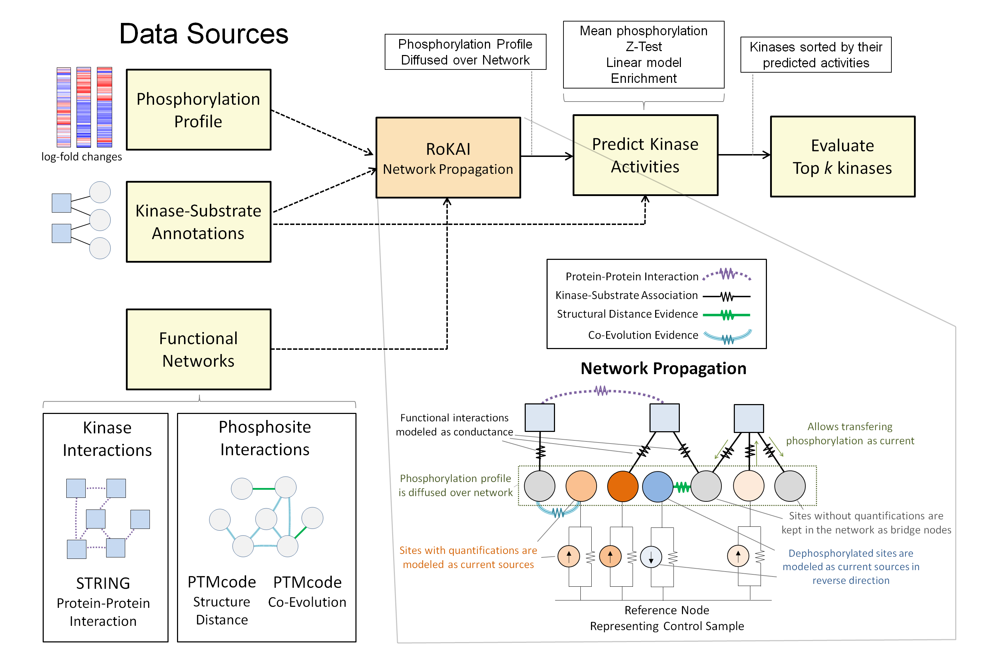

## The workflow and the key idea of RoKAI.
Traditional algorithms for kinase activity inference use condition-specific phosphorylation data and available kinase-substrate associations to identify kinases with differential activity in each condition. RoKAI integrates functional networks of kinases and phosphorylation sites to generate robust phosphorylation profiles. The network propagation algorithm implemented by RoKAI ensures that unidentified sites that lack quantification levels in a condition canstill be used as bridges to propagate phosphorylation data through functional paths.

