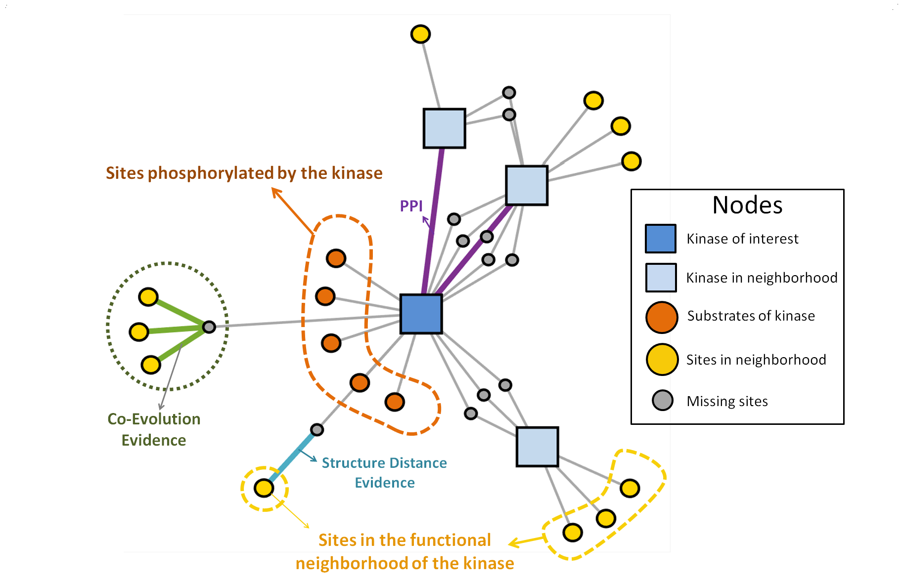

## The workflow and the key idea of RoKAI.
Traditional algorithms for kinase activity inference use condition-specific phosphorylation data and available kinase-substrate associations to identify kinases with differential activity in each condition. RoKAI integrates functional networks of kinases and phosphorylation sites to generate robust phosphorylation profiles. The network propagation algorithm implemented by RoKAI ensures that unidentified sites that lack quantifications in a condition can still be used as bridges to propagate phosphorylation data through functional paths.

## The hypothesis behind RoKAI
We hypothesize that the dysregulation of a kinase happens as a result of a coordinated change in the signaling rather than an individual event. Therefore, the phosphorylation of sites in the functional neighborhood of a kinase can be predictive of its activity. By propagating site phosphorylations over functional networks, RoKAI aims to generate refined profiles capturing the coordinated changes which can be used to improve the reliability of kinase activity inference.

